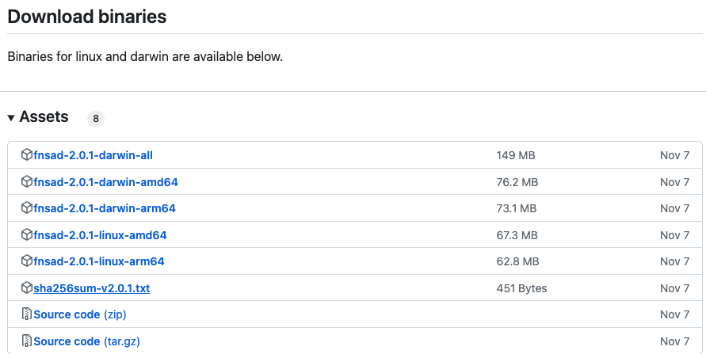

# CLI 설치

핀시아는 오픈소스 프로젝트 이기 때문에 직접 빌드하여 사용할 수도 있고 바이너리를 다운로드하여 사용할 수도 있다.

### 실행파일 다운로드

개발자가 아니면 소스코드를 빌드하는 절차가 복잡하여 바이너리를 받는 것이 편할 것임.

[finschia의 릴리즈](https://github.com/Finschia/finschia/releases) 페이지에서 자신의 OS용 바이너리를 받아 실행한다.

현 시점에서 윈도우용 바이너리는 제공되지 않는다.

<figure><figcaption></figcaption></figure>

### 소스코드 빌드하기

<pre class="language-bash"><code class="lang-bash">$ git clone git@github.com:Finschia/finschia.git
<strong>$ cd finschia
</strong><strong>$ make build
</strong><strong>$ make install
</strong></code></pre>

이 후 새 터미널에서 `fnsad` 가 실행되면 성공

```bash
$ fnsad version
main-df5fc0027a485b346d0a6d1afd2a9af41d163c86
```

참고자료: [핀시아 어플리케이션 설치하기](https://docs.finschia.network/ko/node-management/install-finschia-app)
