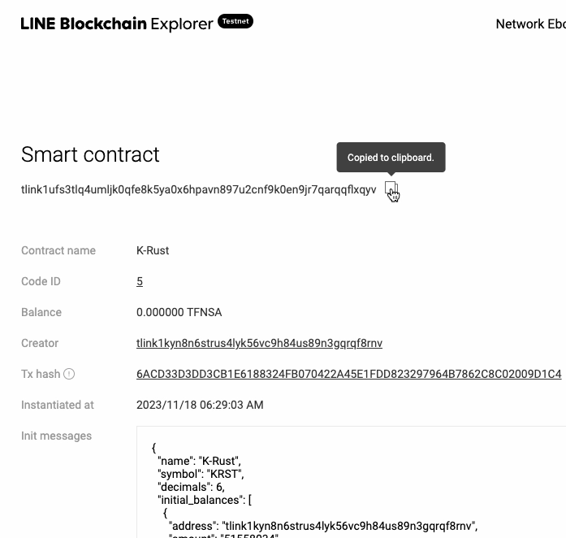

# 케플러에 K-Rust토큰 추가하기

## K-Rust 토큰

* 가치 없는 학습용 CW-20토큰
* 에보니 테스트넷 에서의 컨트랙트 주소는 `tlink1ufs3tlq4umljk0qfe8k5ya0x6hpavn897u2cnf9k0en9jr7qarqqflxqyv`
* 발행량 `5,158,034`는 2023년 대한민국 인구수
* 트위터(9riousen)나 핀시아 디스코드(김택배)으로 획득

## 컨트랙트 주소 복사하기



위의 링크에서 "주소복사" 버튼을 눌러 복사한다.

<figure><figcaption></figcaption></figure>

## 토큰 추가

☰ → 토큰 추가 → Ebony → 토큰 추가

<figure><figcaption></figcaption></figure>

복사해 둔 컨트랙트 주소를 입력하면 나머지 필드는 자동 입력됨

<figure><figcaption></figcaption></figure>

1 `KRST`를 받은 상태. 네이티브 코인과 달리 `cw20` 이라 표시됨
