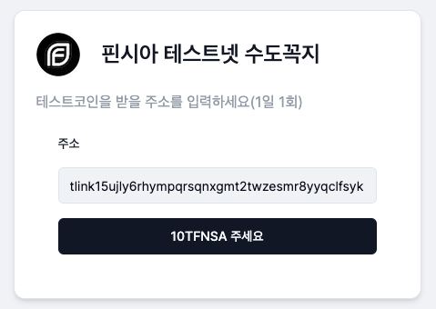

# 🪙 테스트 코인 받기

컨트랙트를 배포하거나 사용하려면 가스비(gas fee)를 지불해야한다.

핀시아 메인넷의 가스비는 `FNSA`로 지불하는데 빗썸등의 거래소에서 구매할 수 있다.

하지만, 테스트넷의 코인은 체인에 따라 디스코드, 트위터, 웹페이지등 여러 형태로 제공하는 수도꼭지([faucet](https://www.youtube.com/watch?v=LBEVXF3dNkw))서비스를 통해 무료로 받을 수 있다.

&#x20;핀시아 테스트넷은 [REST 형태로 수도꼭지 API를 제공](https://docs.finschia.network/ko/node-management/node-setup-testnet#faucet)한다(하루에 10 `TFNSA` 무료).

이를 사용하여 웹페이지를 만들어 보았으니 소개한다.

### TFNSA 수도꼭지 (브라우져)

[https://tfnsa-faucet.vercel.app/](https://tfnsa-faucet.vercel.app/)

