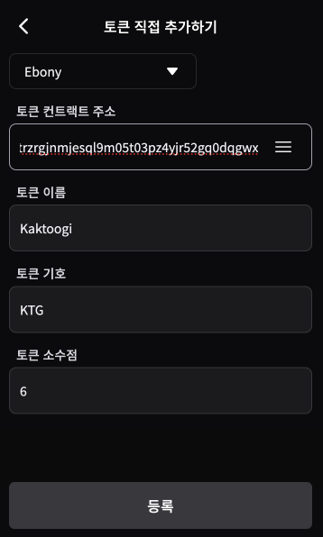
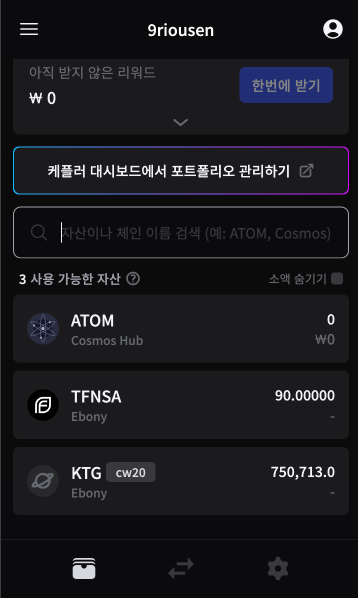

# 💥 케플러에 토큰 표시하기

## 깍두기 토큰

* 핀시아가 제공하는 스마트 컨트랙트 환경은 [CosmWasm](https://cosmwasm.com/)(코즘와즘) 이며 코스모스 계열 블록체인의 표준
* 예제로 [CW-20표준](https://github.com/CosmWasm/cw-plus/blob/main/packages/cw20/README.md)"깍두기" 토큰 발행함
  * 컨트랙트 주소: [tlink1u9hwyy9yjjhh03hr4sqvk9trzrgjnmjesql9m05t03pz4yjr52gq0dqgwx](https://explorer.blockchain.line.me/ebony/wasm/contract/tlink1u9hwyy9yjjhh03hr4sqvk9trzrgjnmjesql9m05t03pz4yjr52gq0dqgwx)
  * X(트위터) [@9riousen](https://twitter.com/9riousen) DM이나 멘션으로 주소알려주시면 1`KTG` 전송해 드립니다 (수동 에어드랍이며 금전적 가치는 없습니다)

## 토큰 추가

☰ → 토큰 추가 → Ebony → 토큰 추가

복사해 둔 컨트랙트 주소를 입력하면 나머지 필드는 자동 입력됨

 

&#x20;`KTG` 라는 심볼의 `cw20` 토큰이 Ebony 상에 잔액과 함께 보여진다
